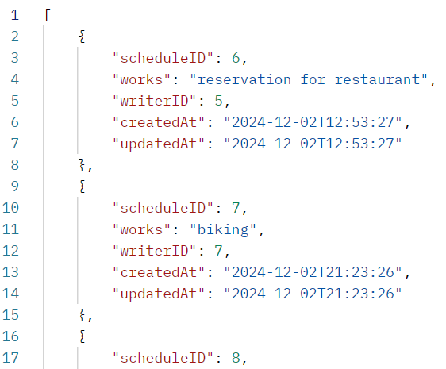
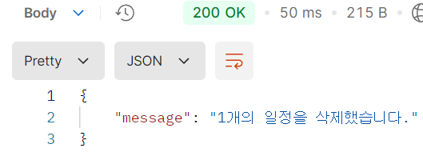

## 일정 관리 앱

### 커밋 컨벤션
아래와 같은 형식을 따라 커밋하세요.

<b><타입>: <제목>

<본문>

<꼬리말><b>
1. 커밋 타입
   🆕: 새 기능 추가

   🔧: 기능 수정 & 개선

   🐛: 버그 수정

   📝: 문서 수정

   🎨: 코드 스타일 변경(들여쓰기 등)

   🏭: 코드 리팩토링(기능 변경 없이 구조만 개선한 경우)

   📁: 파일 구조 변경

2. 제목
   이 커밋에 대한 간략한 설명

예) Main 클래스 리팩토링

3. 본문(선택 사항)
   이 커밋에 대한 추가 설명

4. 꼬리말(선택 사항)
   기타 참고사항 기술


### ERD


### API 명세서
| 기능     | Method | URL                    | Request                       | Response                    |
|--------|--------|------------------------|-------------------------------|-----------------------------|
| 일정 생성  | POST   | /schedule              | [일정 등록 요청](#일정 등록 요청)         | [일정 등록 결과](#일정 등록 결과)       |
| 일정 조회  | GET    | /schedule              | [일정 조회 요청](#일정 조회 요청)         | [일정 조회 정보](#일정 조회 정보)       |
| 단일 일정 조회 | GET | /schedule/{scheduleID} | [단일 일정 조회 요청](#단일 일정 조회 요청)   | [단일 일정 조회 정보](#단일 일정 조회 정보) |
| 일정 페이지 조회 | GET | /schedule/page         | [일정 페이지 조회 요청](#일정 페이지 조회 요청) | [일정 조회 정보](#일정 조회 정보)       |
| 일정 수정  | PATCH  | /schedule              | [일정 수정 요청](#일정수정 요청)          | [일정 수정 결과](#일정 수정 결과)       |
| 일정 삭제 | PUT    | /schedule              | [일정 삭제 요청](#일정 삭제 요청)         | [일정 삭제 결과](#일정 삭제 결과)       |

| 기능        | Method | URL                    | Request             | Response              |
|-----------|--------|------------------------|---------------------|-----------------------|
| 작성자 생성    | POST | /writer | [작성자 등록 요청](#작성자 등록 요청) | [작성자 등록 결과](#작성자 등록 결과) |
| 단일 작성자 조회 | GET | /writer/{writerID| [단일 작성자 조회 요청](#단일 작성자 조회 요청) | [단일 작성자 조회 정보](#단일 작성자 조회 정보) |


#### 일정 등록 요청

```json 
{
   "header": {
      "Content-Type": "application/json"
   },
   "body": {
     "works":     "할일(VARCHAR(200))",
     "writer":    "작성자번호(INT)",
     "password":  "비밀번호(VARCHAR(20), UNIQUE)"
   }
}
```

#### 일정 등록 결과

```json
{
    {
      "status": 200,
      "message": "등록 결과('N건의 일정이 등록되었습니다.')"
    },
    {
    "status": 400(이미 사용중인 비밀번호인 경우),
    "message":  "등록 결과(STRING, '이미 사용중인 비밀번호입니다.')"
    },
    {
    "status": 404(일치하는 작성자번호가 없는 경우),
    "message": 등록 결과(STRING, "일치하는 작성자가 없습니다.")
    }
}
```

#### 일정 조회 요청
```json
{
   "header": {
      "Content-Type": "application/json"
   },
   "query parameter": {
      "writer(optional)":       "작성자(INT)",
      "updatedAt(optional)":    "수정일(DATE, 'YYYY-MM-DD')"
   }
}
```

#### 일정 조회 정보
```json
[
  {
       "status":  200,
       "message": "조회 결과('N건의 일정이 조회되었습니다.')",
       "body": [
       { 
          "scheduleID":   "식별번호(INT)", 
          "works":        "할일(VARCHAR(200))", 
          "writer":       "작성자번호(INT)", 
          "createdAt":    "등록일(DATETIME)", 
          "updatedAt":    "수정일(DATETIME)"
       },
       "...",
       {}
      ]
    },
    {
      "status":   "404(일치하는 일정이 없는 경우)",
      "message":  "조회 결과(STRING, '해당하는 일정이 없습니다.')"
    }
]
```

#### 단일 일정 조회 요청
```json
{
   "header": {
      "Content-Type": application/json
   },
   "path parameter": {
      "scheduleID": 일정 ID(INT)
   }
}
```

#### 단일 일정 조회 정보
```json
{
   "status":  200,
   "message": 조회 결과("N건의 일정이 조회되었습니다."),
   "body": {
     "scheduleID":  식별번호(INT),
     "works":       할일(VARCHAR(200)),
     "writer":      작성자번호(INT),
     "createdAt":   등록일(DATETIME),
     "updatedAt":   수정일(DATETIME)
   },
},
{
   "status":   404(일치하는 일정이 없는 경우),
   "message":  조회 결과(STRING, "해당하는 일정이 없습니다.")
}
```

#### 일정 페이지 조회 요청
```json
{
   "header": {
      "Content-Type": application/json
   },
   "query parameter": {
      "offset(optional)": 조회할 페이지(INT, 1부터 시작)
      "size":             페이지 크기(INT)
   }
},
```

#### 일정 수정 요청
```json
{
   "header": {
      "Content-Type": application/json
   },
   "body": {
     "password":          비밀번호(VARCHAR(20)),
     "works(optional)":   할일(VARCHAR(200)),
     "writer(optional)":  작성자번호(INT)
   }
}
```

#### 일정 수정 결과
```json
{
   "status":  200,
   "message": 수정 결과(STRING, "N건의 일정이 수정되었습니다.")
},
{
   "status":   404(일치하는 일정이 없는 경우),
   "message":  수정 결과(STRING, "해당하는 일정이 없습니다.")
}
```

#### 일정 삭제 요청

```json
{
   "header": {
      "Content-Type": application/json
   },
   "body": {
     "scheduleID":  식별번호(ID),
     "password":    비밀번호(VARCHAR(20))
   }
}
```

#### 일정 삭제 결과
```json
{
   "status":  200,
   "message": 삭제 결과("N건의 일정이 삭제되었습니다.")
},
{
   "status":   404(일치하는 일정이 없는 경우),
   "message":  삭제 결과(STRING, "해당하는 일정이 없습니다.")
}
```

#### 작성자 등록 요청

```json
{
   "header": {
      "Content-Type": application/json
   },
   "body": {
     "writerName":  작성자 이름(VARCHAR(15))
     "email":       이메일(VARCHAR(75), UNIQUE)
   }
}
```

#### 작성자 등록 결과
```json
{
   "status":  200,
   "message": 등록 결과(STRING, "OOO님, 환영합니다.")
},
{
  "status": 400(이미 등록된 이메일 주소인 경우),
  "message": 등록 결과(STRING, "이미 사용중인 이메일 주소입니다.")
}
```

#### 단일 작성자 조회 요청
```json
{
   "header": {
      "Content-Type": application/json
   },
   "path parameter": {
      "writerID": 작성자 번호(INT)
   }
}
```

#### 단일 작성자 조회 정보

```json
{
   "status": 200,
   "message": 조회결과("N명의 작성자가 조회되었습니다."),
   "body": {
     "writerID": 작성자번호(INT),
     "writerName": 작성자이름(VARCHAR(15),
     "email": 이메일(VARCHAR(75)),
     "createdAt": 등록일(DATETIME),
     "updatedAt": 수정일(DATETIME)
   }
},
{
  "status": 404(일치하는 작성자가 없는 경우),
  "message": 조회결과("일치하는 작성자가 없습니다.")
}
```

### 구현 사항들
1. 일정 CRUD


- 사용자에게 일, 작성자 ID, 비밀번호를 입력받아 일정을 생성할 수 있다.
  
  
    - 이 때 작성자 ID는 작성자 테이블의 기본키와 연결된 외래키이다.
    - 존재하지 않는 ID로 일정 작성 시 에러가 반환된다.
      
    - 중복된 비밀번호는 사용할 수 없다.


- 일정 ID, 작성자 ID, 수정일 등을 통해 일정을 조회할 수 있다.
  
  
  
  
    - 혹은 아무것도 입력하지 않고 모든 일정을 조회할 수도 있다.
      
      


- 비밀번호, 일, 작성자 ID를 입력받아 일정을 수정할 수 있다.
  
  


  - 비밀번호는 필수로 입력해야 하며, 일과 ID 중 하나 이상은 입력에 포함되어야 한다.
      
      


- 비밀번호와 일정 ID를 입력받아 일정을 삭제할 수 있다.
  
  


2. 작성자 생성 및 조회


- 작성자 이름, 이메일을 입력받아 작성자를 생성할 수 있다.
  
  


- 중복된 이메일은 사용할 수 없다.
  


- 작성자 ID를 기반으로 작성자를 조회할 수 있다.
  
  

- 작성자 이름으로도 작성자를 조회할 수 잇다.
    
    


3. 일정 페이징 조회


- query parameter로 offset, size를 입력해 원하는 위치부터 원하는 양의 일정을 조회할 수 있다.
  
  


- offset은 1부터 시작하며, size는 양의 정수여야 한다.
  


4. 요청/응답 데이터 검증 및 예외 처리


- 요청 데이터들이 정의된 형식에 맞는지 검증하도록 하고, 맞지 않다면 400 상태코드를 반환하도록 하였다.
  

- Repository에 AOP를 적용해 조회 결과 리스트 길이 혹은 쿼리에 영향받은 row 수가 0이 아닌지를 검사하도록 하였다.
  
    - 결과값이 0이라면 상황에 맞는 에러 메시지와 404 응답코드를 반환하도록 하였다.


5. API 테스트


- postman을 이용해 API의 각 기능들이 잘 동작하는지 확인할 수 있도록 입력 상황별 테스트들을 구현하였다.
  